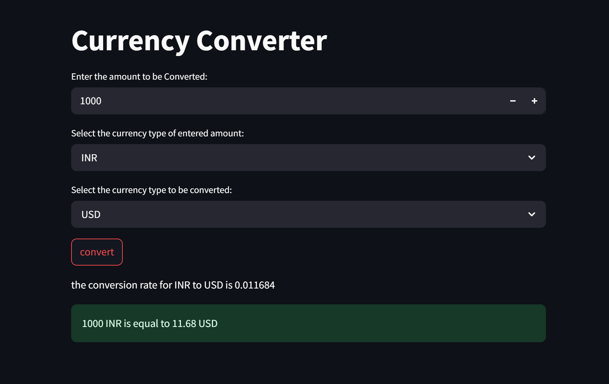

# 💱 Currency Converter App

A simple and beautiful web-based Currency Converter built using **Streamlit** and powered by the [ExchangeRate Host API](https://exchangerate.host).

## 🚀 Live Demo

> 🔗 [Deploying on Streamlit Cloud...]

## 📸 Preview

  
<sup>*This is a placeholder. You can add a screenshot of your app once deployed.*</sup>

## ✨ Features

- Convert between multiple currencies
- Real-time exchange rates
- Clean and minimal UI
- Supports currencies like: `USD`, `INR`, `EUR`, `GBP`, `JPY`, `SAR`, `AED`, `BHD`, `QAR`

## 🛠️ Built With

- [Python 🐍](https://www.python.org/)
- [Streamlit 📊](https://streamlit.io/)
- [ExchangeRate Host API 🌍](https://exchangerate.host/#/)

## 📦 Installation

Clone the repo and run it locally:

```bash
git clone https://github.com/your-username/currencyconverter.git
cd currencyconverter
pip install -r requirements.txt
streamlit run App.py


